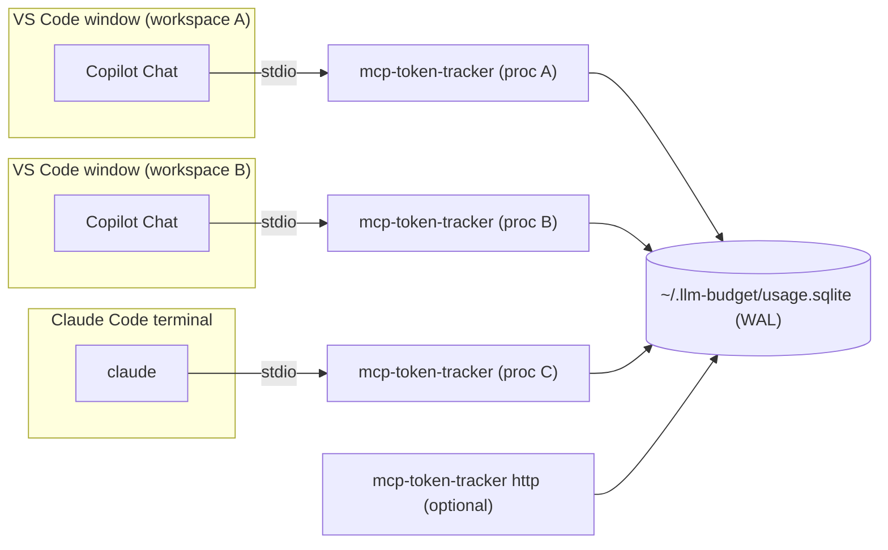
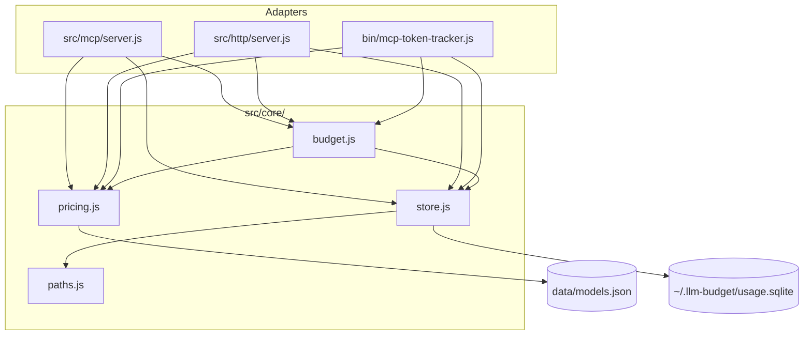
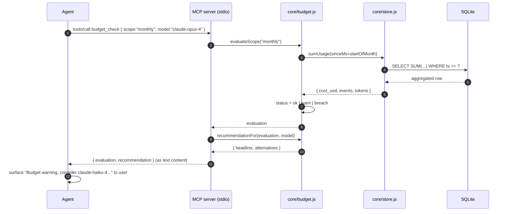
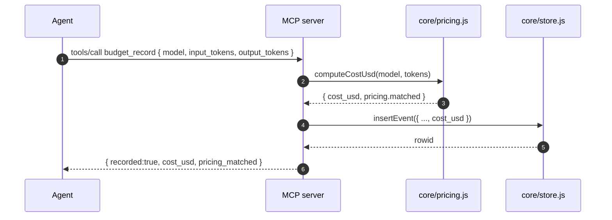

# 04 — Architecture

## Process model (Stage 1)

Stage 1 has **one short-lived process per host session**. There is no
background daemon yet — that lands in Stage 3.

Three different agent hosts each spawn their own MCP server process. All
three processes read and write the **same** SQLite file. SQLite's WAL
journal mode makes concurrent reads and serialized writes safe across
processes on every supported OS.

## Module diagram

The dependency graph points one way: **adapters → core → storage**. Core
has no knowledge of MCP or HTTP — it can be unit-tested in isolation.

## Lifecycle of a request

### `budget_check` (called by agent at session start)

### `budget_record` (called after each turn)

## Concurrency model

- SQLite is opened in **WAL mode** with `synchronous = NORMAL`. This lets
  multiple processes read freely while writes are serialized.
- Each MCP server process holds its own DB handle (`better-sqlite3` is
  synchronous, per-handle).
- No locking is done in JS — SQLite handles it.

## Data flow boundary

| Boundary | What crosses it | What does not |
|---|---|---|
| Agent ↔ MCP server | tool calls with model name + token counts | prompt text, response text |
| MCP server ↔ SQLite | aggregated counts + cost | nothing else |
| HTTP server ↔ caller | read-only status JSON | no write access without explicit POST |
| Local machine ↔ network | **nothing** in Stage 1 | — |

## Failure modes & handling

| Failure | Behavior |
|---|---|
| `~/.llm-budget` not writable | `ensureRoot()` throws on startup; CLI prints a clear error |
| SQLite file corruption | WAL recovery on open; if unrecoverable, user runs `reset --yes` |
| Unknown model name | Cost recorded as 0; response includes `pricing_unknown:true` so agent can warn the user |
| Pricing cache stale | Bundled prices used; no impact on availability |
| Two processes write at the same instant | SQLite serializes; one waits a few ms |
| Agent never calls `budget_record` | Counts go to 0; recommendation says "no usage observed — verify hook is wired" |

## Extension points (for later stages)

- `src/core/store.js` exposes `insertEvent`; a future log-watcher daemon
  can write into the same table via the same function.
- `data/models.json` is hot-reloadable; replacing `~/.llm-budget/pricing-cache.json`
  overrides bundled prices.
- New scopes can be added by extending `evaluateScope()` without touching
  the MCP tool surface.
