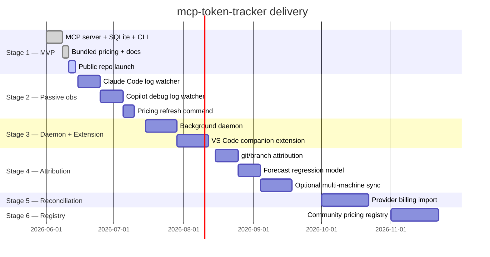

# 12 — Roadmap

A condensed view of where the project is heading. Detail lives in
[05-future-steps.md](05-future-steps.md).

## Versioning

- **0.1.x** — Stage 1 (current). Schema may change without migration.
- **0.2.x** — Stage 2 lands. First **public** schema; migrations begin.
- **0.x → 1.0** when daemon + extension ship and three external users
  report a month of clean operation.

## Backward compatibility commitments

- After 0.2.0: any new column added to `events` must be nullable.
- After 1.0.0: MCP tool input schemas can only add optional fields, never
  remove or rename. Tool removals require a deprecation cycle.

## What we will not do

- Build a hosted dashboard or SaaS.
- Ingest prompt content even if a user requests it. Forks may.
- Add features that require an account.
- Add a billing/payment layer.

## How to influence the roadmap

- Open issues with concrete use cases (numbers help — "I spend ~$X on Y").
- Send PRs that include tests and update docs in the same change.
- For larger changes, open a discussion first; small ones can go straight
  to PR.
